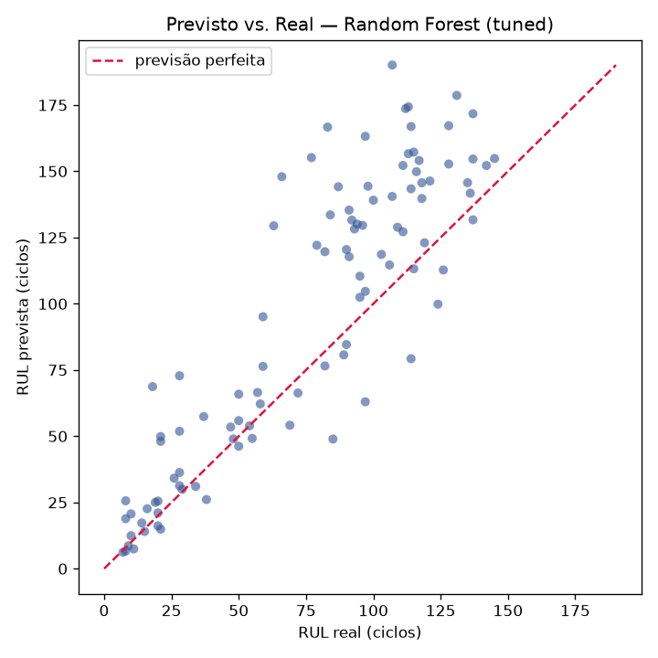
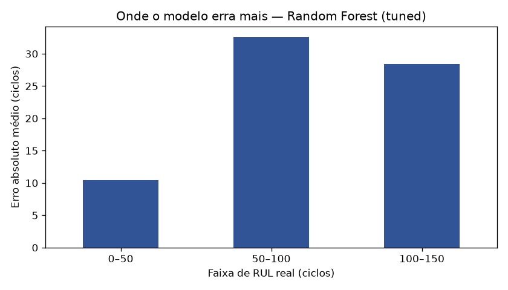

# Manutenção Preditiva de Motores — Previsão de Vida Útil Restante (RUL)

Modelo de **regressão supervisionada** que estima quantos ciclos de operação restam
até a falha de motores turbofan, a partir de leituras de sensores (dataset **NASA
C-MAPSS**, subconjunto FD001).

## O problema

Em manutenção preditiva, a pergunta de negócio é: *quanto tempo ainda dá para operar
este equipamento antes de ele falhar?* Acertar isso evita tanto a parada inesperada
(cara e perigosa) quanto a troca prematura de peças boas. Aqui o alvo é a **RUL —
Remaining Useful Life**, em ciclos.

## Dataset

NASA C-MAPSS / **FD001**: 100 motores no treino, cada um operado **até a falha**
(20.631 leituras), e 100 motores no teste com a série truncada antes da falha, mais o
RUL verdadeiro de cada um. Cada leitura traz 3 ajustes operacionais + 21 sensores.

> `data/` não é versionado. Como baixar está em **[Como rodar](#como-rodar)**.

## Abordagem

1. **EDA** — distribuição da duração de vida e trajetória dos sensores ao longo do
   tempo. Como o FD001 tem uma única condição de operação, **7 colunas são constantes**
   (`op_setting_3`, `sensor_1/5/10/16/18/19`) e foram descartadas; sobraram 17 features.
   A correlação de cada sensor com a RUL identifica quais carregam o sinal de degradação
   — interpretar o *significado físico* desses sinais é onde meu background em Física pesa.
2. **Alvo** — `RUL = (último ciclo do motor) − (ciclo atual)`. Padronização com
   `StandardScaler` ajustado **apenas no treino**.
3. **Modelos** — baseline (Regressão Linear) como piso, comparado a **Random Forest** e
   **Gradient Boosting**, com um `GridSearchCV` enxuto no Random Forest.
4. **Avaliação** — previsão na **última leitura** de cada motor de teste vs. o RUL real.

## Resultado

Métrica em **ciclos** de operação (teste FD001, valores desta execução real):

| Modelo | RMSE | MAE |
|---|---:|---:|
| Baseline (Linear) | 31.99 | 25.47 |
| Random Forest | 33.93 | 24.81 |
| Gradient Boosting | 32.60 | 23.54 |
| **Random Forest (tuned)** | **31.93** | 23.93 |

O melhor modelo erra, em média, **~24 ciclos (MAE)**. Os ensembles reduzem o MAE frente
ao baseline linear, mas o **RMSE fica ~32** porque o erro se concentra nos motores
**longe da falha** — quando a degradação ainda é fraca nos sensores, o modelo subestima
a RUL. O gráfico previsto×real mostra exatamente esse "teto":



E o erro por faixa de RUL confirma onde ele se concentra:



## Como rodar

```bash
# 1. Ambiente
python -m venv .venv && source .venv/bin/activate
pip install -r requirements.txt

# 2. Dataset FD001 em data/ (escolha UMA das fontes abaixo)

# (a) Kaggle (fonte canônica — requer ~/.kaggle/kaggle.json):
kaggle datasets download -d behrad3d/nasa-cmaps -p data/ --unzip

# (b) Espelho público usado neste projeto (sem credencial):
for f in train_FD001.txt test_FD001.txt RUL_FD001.txt; do
  curl -sL -o "data/$f" \
    "https://raw.githubusercontent.com/hankroark/Turbofan-Engine-Degradation/master/CMAPSSData/$f"
done

# 3. Treinar e avaliar (imprime as métricas e gera as figuras)
python -m src.model

# 4. (Opcional) Abrir o notebook com a análise passo a passo
jupyter lab notebooks/01_eda_modelagem.ipynb
```

## Estrutura

```
src/data.py       # carregamento do C-MAPSS (nomes de coluna, leitura)
src/features.py   # alvo RUL, descarte de sensores constantes, última leitura
src/model.py      # treino, GridSearch, avaliação e figuras
notebooks/        # 01_eda_modelagem.ipynb — EDA + modelagem narradas
reports/figures/  # gráficos exportados
```

## Limitações e próximos passos

- Usa **apenas o FD001** (uma condição de operação, um modo de falha); FD002–FD004 são
  mais difíceis (múltiplas condições/falhas).
- Com a **RUL linear**, o RMSE é dominado pela região de RUL alta. O passo padrão na
  literatura é **limitar a RUL** (ex.: clipar em ~125 ciclos), refletindo que muito antes
  da falha a vida restante não é prevista pelos sensores — costuma derrubar bastante o RMSE.
- Features de **janela temporal** (médias/desvios móveis dos sensores) tendem a capturar
  melhor a tendência de degradação.

> Todos os números deste README vêm da execução real de `python -m src.model`.
> Nenhuma métrica foi inventada.
